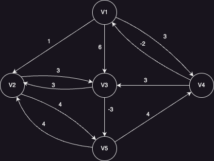

# Floyd-Warshall Algorithm

Graph algorithm for finding the shortest paths between all pairs of nodes in a weighted graph. It works for both directed and undirected graphs and handles negative edge weights, as long as there are no negative cycles.

Unlike Dijkstra or Bellman-Ford, Floyd-Warshall is not limited to a single source. It builds a complete distance matrix between every pair of nodes.

Uses a weighted adjacency matrix or distance matrix as a data structure.

## Pseudocode

    G[i][j] = weight of edge i→j if exists, else ∞
    G[i][i] = 0 for all i

          j →
          A  B  C  D  E
    i A  [ 0, 1, 6, 3, ∞ ]
    ↓ B  [ ∞, 0, 3, ∞, 4 ]
      C  [ ∞, 3, 0, ∞,-3 ]
      D  [-2, ∞, 3, 0, ∞ ]
      E  [ ∞, 4, ∞, 4, 0 ]

    G = [
      [0, 1, 6, 3, Infinity],
      [Infinity, 0, 3, Infinity, 4],
      [Infinity, 3, 0, Infinity, -3],
      [-2, Infinity, 3, 0, Infinity],
      [Infinity, 4, Infinity, 4, 0],
    ]

    FLOYD_WARSHALL(G, vertices):
      FOR k FROM 0 TO LENGTH(vertices) - 1:
        FOR i FROM 0 TO LENGTH(vertices) - 1:
          FOR j FROM 0 TO LENGTH(vertices) - 1:
            IF G[i][k] + G[k][j] < G[i][j]:
              G[i][j] = G[i][k] + G[k][j]

      return G

## Explanation

- Start with a 2D matrix `G` where `G[i][j]` represents the weight of the edge from `i` to `j`, or `∞` if there’s no direct connection.
- Loop over each possible intermediate vertex `k`.
  - For every pair of vertices `(i, j)`, check whether the path `i → k → j` is shorter than the currently known `i → j` path.
- If so, update `G[i][j]` with the shorter distance.
- After all iterations, `G[i][j]` will contain the shortest distance between every node pair.

## Characteristics

### Time Complexity:

- `O(vertices³)`: due to three nested loops over all vertices.

### Space Complexity:

- `O(vertices²)`: for storing the distance matrix.

## Notes

- Handles negative edge weights.
- Detects negative cycles if `D[i][i] < 0` after processing.
- Slower than Dijkstra or Bellman-Ford, but provides all-pairs shortest paths.

## Common Use Cases

- Computing transitive closure in graphs
- All-pairs routing in networks
- Evaluating consistency of constraints in logic or scheduling
